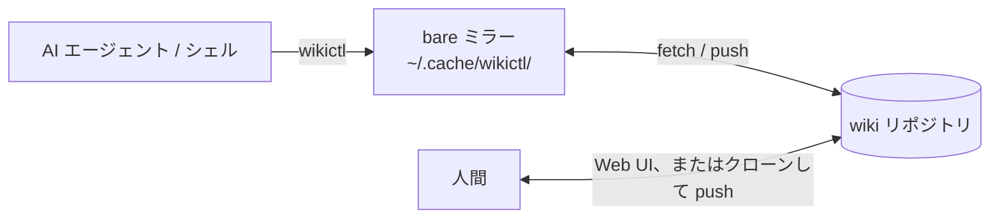

# wikictl

[English](README.md)

wikictl は、Git リポジトリに置いた Markdown の wiki を操作するコマンドラインツールです。AI エージェントと人間が共有する知識ベースを想定しています。エージェントはシェルからページを検索・記録し、人間は同じページを Git ホストの Web UI や、Obsidian などのエディタで開いたクローンで読み書きします。クローンで編集する人は通常どおりコミットして push し、その変更と wikictl の変更はリポジトリ上で合流します。

wikictl はサーバーを起動せず、インデックスも作業ツリーも持ちません。wiki 自体は wikictl に依存しない素の Markdown なので、どのエディタでも扱えます。



## 前提条件

- Linux または macOS
- `PATH` 上に `git` があること
- 対話なしで wiki リポジトリから fetch し、push できること（credential helper、SSH エージェント、ローカルパスならファイルへのアクセス権）。すべてのコマンドは最初に fetch するため、読み取りだけでもこの条件が必要
- wiki のブランチへ直接 push できること。プルリクエストを必須にするブランチ保護があると、書き込みはすべて失敗する
- インストールスクリプトを使う場合は `curl` と、`sha256sum` または `shasum`。ソースからビルドする場合は Go 1.26.5 以降

リポジトリは Git ホスト、SSH で接続できるサーバー、ローカルのディレクトリのいずれにも置けます。設定の `repo` はそのまま git に渡されます。

| 置き場所 | `repo` の例 |
|---|---|
| Git ホスト | `git@github.com:you/wiki.git` |
| SSH で接続できるサーバー | `ssh://you@server.example/srv/git/wiki.git` |
| ローカルのディレクトリ | `/home/you/wiki.git` |

`repo` にパスワードやトークンを書かないでください。git は URL をそのままミラーに保存します。HTTPS の URL と git の credential helper、または SSH の URL と SSH エージェントを使ってください。

サーバーやローカルに置く場合は、`git init --bare -b main ~/wiki.git` でリポジトリを作成します。空のリポジトリでは wikictl は `main` に書き込むため、リポジトリの HEAD が `master` など別のブランチを指している場合は、設定の `branch` にそのブランチ名を指定してください。

## インストール

最新リリースを `~/.local/bin` にインストールします。

    curl -fsSL https://raw.githubusercontent.com/roamer7038/wikictl/main/install.sh | sh

スクリプトは OS とアーキテクチャに合うバイナリを選び、チェックサムを検証します。特定のバージョンをインストールするには `WIKICTL_VERSION`（例：`v0.2.0`）を、インストール先を変えるには `WIKICTL_INSTALL_DIR` を設定します。ソースからビルドすることもできます。

    go install github.com/roamer7038/wikictl/cmd/wikictl@latest

Linux と macOS（x86_64、arm64）のバイナリは [Releases ページ](https://github.com/roamer7038/wikictl/releases) にあります。

## クイックスタート

1. 空の wiki リポジトリを作成し、対話なしで `git push` できることを確認します。
2. `~/.config/wikictl/config.yaml` を作成します。

       repo: git@github.com:you/wiki.git
       author:
         name: claude-code@laptop
         email: claude-code@laptop.invalid

3. 設定を確認し、初期ページを作成してから、ページを書き込んで読み出します。

       wikictl context
       wikictl init
       printf -- '---\nsummary: --force-with-lease 付きの push は、リモートの ref が期待する sha のままでなければ拒否される\n---\n# --force-with-lease は何を保証するか\n\n本文。\n\n## Links\n- part_of: [index](index.md)\n' \
         | wikictl put global/git-force-with-lease.md
       wikictl search lease
       wikictl get global/git-force-with-lease.md
       wikictl lint

## wiki の構成

最上位の各ディレクトリは、「その知識がどこで有効か」を表すスコープです。ページは、当てはまる中で最も狭いスコープに置きます。

| ディレクトリ | 有効な範囲 |
|---|---|
| `global/` | 全員 |
| `personal/` | このユーザーのみ。マシンやプロジェクトは問わない |
| `projects/<name>/` | 特定のプロジェクト |
| `machines/<name>/` | 特定の実行環境 |

`search`、`ls`、`lint` は、既定でこの 4 つのディレクトリを対象にします。`projects/` の `<name>` はカレントディレクトリの `origin` リモートのリポジトリ名、`machines/` の `<name>` はホスト名の最初の `.` までで、どちらも小文字にし、設定で変えられます。カレントディレクトリが git リポジトリの外にあるか `origin` リモートが無ければ、`projects/` のディレクトリは使いません。`--dirs a,b` または設定の `dirs` で一覧を置き換えられ、`--dirs .` は wiki 全体を対象にします。使われるディレクトリは `wikictl context` で確認できます。

`personal/` には、エージェントが必要になったときに検索して参照する事実を置きます。すべての会話に適用すべきルールは、`CLAUDE.md` などエージェントに常に読み込まれる指示に書きます。複数人で共有する wiki では全員が同じ `personal/` を検索するため、`personal/` を使わないか、`dirs` を設定してください。

ページは、いずれかのディレクトリの中に置く Markdown ファイルです。フロントマターには 1 行の `summary` を書き、他のページとの関係は末尾の `## Links` セクションに書きます。

```markdown
---
summary: このページが答える問いを 1 文で
type: concept
---
# タイトル

本文。他のページへは相対パスでリンクする: [index](index.md)。

## Links
- part_of: [index](index.md)
- cites: https://example.com/spec | この出典が裏付ける内容
```

- wikictl が解釈するフロントマターのキーは、`summary`（または `description`）、`type`、`tags`、`aliases`、`status: deprecated`（`search` と `ls` に表示しない）
- ページへのリンクは、`mv` が書き換えられるように `[text](path)` の形式で書く
- 各ディレクトリに `index.md` を置いて `summary` にディレクトリの内容を書き、他のページから `- part_of: [index](index.md)` でリンクする。`wikictl dirs` がその summary を表示し、`wikictl get <dir>/index.md` がそれらのページをバックリンクとして一覧する
- 名前には小文字の ASCII 英字、数字、ハイフンを使うことを推奨する

形式の規則の詳細は `wikictl help lint` で確認できます。

## コマンド

| コマンド | 説明 |
|---|---|
| `init` | 空のリポジトリに初期ページを作成する |
| `search <word>...` | 指定した語を含むページを検索する |
| `get <path>` | ページを sha、リンク、バックリンクとともに表示する |
| `ls` | ページを一覧表示する |
| `put <path> < content` | 標準入力の内容でページを作成または置換する |
| `mv <path> <newpath>` | ページまたはディレクトリを移動・名前変更し、リンクを書き換える |
| `rm <path>` | ページを削除する |
| `lint [<path>...]` | wiki の形式に違反するページを報告する |
| `dirs [<dir>...]` | wiki のディレクトリをページ数とともに一覧表示する |
| `context` | 解決済みの設定と検索対象ディレクトリを表示する |
| `help [<command>]` | コマンドのヘルプを表示する |
| `version` | バージョンを表示する |

各コマンドのフラグ、挙動、JSON 出力は `wikictl help <command>` で確認できます。`help` 以外のどのコマンドも、`--json` を付けるとプログラムで処理しやすい JSON を出力します。

既存のページを更新するときは、`get` が表示する `sha` を `put --base` に渡します。その間にページが変更されていた場合、`put` は終了コード 3 で終了して現在の内容を出力します。wikictl が自動でマージすることはありません。

## 設定

wikictl は、`--config <path>`、`$WIKICTL_CONFIG`、`$XDG_CONFIG_HOME/wikictl/config.yaml`（`~/.config/wikictl/config.yaml`）のうち最初に当てはまるものを設定ファイルとして読みます。

| キー | 必須 | 意味 |
|---|---|---|
| `repo` | 必須 | wiki リポジトリの URL またはパス。プロファイル側で設定してもよい |
| `branch` | 任意 | 使うブランチ。省略時はミラーに保存したブランチ、なければリモートの HEAD、なければ `main` で、保存したブランチに固定される（`wikictl help context` を参照） |
| `author.name`, `author.email` | 任意 | コミットの author。それぞれ `git config user.name`、`user.email` にフォールバックする |
| `machine` | 任意 | `machines/<name>/` の `<name>` |
| `dirs` | 任意 | 既定の 4 つの代わりに使う検索対象ディレクトリ |
| `projects` | 任意 | `origin` のリポジトリ名から `projects/` 配下のディレクトリ名への対応表 |
| `profiles` | 任意 | 上記のキーを上書きする名前付きプロファイル |
| `default_profile` | 任意 | 他の規則でプロファイルが決まらないときに使うプロファイル |

未知のキーは設定エラー（終了コード 2）になります。

プロファイルを使うと、個人用と業務用のように複数の wiki を 1 つの設定ファイルで扱えます。最上位のキーが既定値になり、プロファイルがそれを上書きします。

```yaml
author:
  name: claude-code@laptop
default_profile: personal
profiles:
  personal:
    repo: git@github.com:you/wiki.git
    author:
      email: you@example.invalid
  work:
    repo: git@github.example.com:team/wiki.git
    author:
      email: you@company.example
    match:
      remotes: ["github.example.com/team/*"]
      paths: ["~/work"]
```

プロファイルは、`--profile`、`$WIKICTL_PROFILE`、`match`（`origin` リモートまたはカレントディレクトリ）、`default_profile` の順に最初に当てはまるもので決まります。プロファイル内の `author.name` と `author.email` は個別に上書きされ、`dirs` と `projects` は最上位の値を丸ごと置き換えます。プロファイルが `repo` を設定した場合、`branch` は継承されません。選択の詳細は `wikictl help context` で確認できます。

## 終了コード

| コード | 意味 |
|---|---|
| 0 | 成功 |
| 1 | エラー（ページが存在しない場合など） |
| 2 | 使い方または設定の誤り |
| 3 | 衝突（ページが既に存在する、または読み取った後にページが変更・削除された） |
| 4 | ページまたはパスが wiki の形式に違反している。`lint` は指摘が 1 件でもあれば 4 で終了する |
| 5 | 読み取りまたは書き込みで git コマンドが失敗した |

## ミラー

wikictl は、wiki リポジトリごとの bare ミラーを `$XDG_CACHE_HOME/wikictl/`（`~/.cache/wikictl/`）に、所有者だけが読めるように置きます。パスは `wikictl context` で確認できます。wiki の内容はリモートにあるため、ミラーはいつ削除してもかまいません。次のコマンド実行時に作り直されます。

## 開発

    go test -race ./...
    go vet ./...
    gofmt -l .
    go build -o wikictl ./cmd/wikictl

GitHub Actions は、プルリクエストでこれらを含む検査を実行します（`.github/workflows/` を参照）。ブランチ、プルリクエスト、リリースの運用ルールは [CONTRIBUTING.md](CONTRIBUTING.md) を参照してください。

## ライセンス

[MIT](LICENSE)
