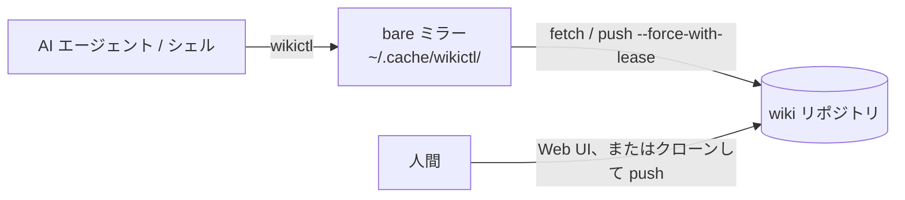

# wikictl

[English](README.md)

wikictl は、Git リポジトリに置いた Markdown の wiki を操作するコマンドラインツールです。AI エージェントと人間が共有する知識ベースを想定しています。エージェントはシェルからページを検索・記録し、人間は同じページを Git ホストの Web UI や、Obsidian などのエディタで開いたクローンで読み書きします。

リポジトリは Git ホスト（GitHub、GitLab、Gitea など）、SSH で接続できるサーバー、ローカルのディレクトリのいずれにも置けます。ホスティングサービスは必須ではありません。

wikictl はサーバーを起動せず、インデックスも作業ツリーも持ちません。bare ミラーに fetch して `git grep`、`git cat-file`、`git log` で読み取り、書き込みは git の plumbing コマンドでコミットを作成して `--force-with-lease` で push します。wiki 自体は wikictl に依存しない素の Markdown なので、どのエディタでも扱えます。



## 前提条件

- Linux または macOS
- `PATH` 上に `git` があること
- wiki リポジトリに対して、対話なしで fetch と push ができること（credential helper、SSH エージェント、ローカルパスならファイルへのアクセス権）。wikictl は git の対話プロンプトを無効にして実行するため、パスワードの入力が必要な場合は待たずに失敗します。すべてのコマンドは最初に fetch するので、読み取りだけの場合も同じ条件が必要です。
- wiki のブランチへ直接 push できること。プルリクエストを必須にするブランチ保護があると、書き込みはすべて失敗します。
- インストールスクリプトを使う場合は `curl` と、`sha256sum` または `shasum`。ソースからビルドする場合は Go 1.26.5 以降

### wiki リポジトリの置き場所

設定の `repo` はそのまま git に渡されるため、git が push できる URL やパスなら何でも指定できます。

| 置き場所 | `repo` の例 |
|---|---|
| Git ホスト | `git@github.com:you/wiki.git` |
| SSH で接続するサーバー | `ssh://you@server.example/srv/git/wiki.git` |
| ローカルのディレクトリ | `/home/you/wiki.git` |

サーバーやローカルに置く場合は、ブランチ名を指定して空の bare リポジトリを作成します。

    git init --bare -b main ~/wiki.git

空のリポジトリでは remote HEAD からブランチを決められないため、wikictl は `main` に書き込みます。`-b main` を付けずに作成して HEAD が `master` を指していると、`git clone` は「remote HEAD refers to nonexistent ref」と警告し、ファイルを取り出しません。`-b main` を付けて作成するか、設定の `branch` に HEAD が指すブランチ名を指定してください。

Git ホストの Web UI を使わない人は、リポジトリをクローンし、通常どおり編集・コミット・push します。wikictl はこれらのクローンを使わず、双方の変更はリポジトリ上で合流します。

## インストール

最新リリースを `~/.local/bin` にインストールします。

    curl -fsSL https://raw.githubusercontent.com/roamer7038/wikictl/main/install.sh | sh

スクリプトは OS とアーキテクチャに合うバイナリを選び、チェックサムを検証します。`~/.local/bin` が `PATH` に含まれていなければ警告を表示します。特定のバージョンをインストールするには `WIKICTL_VERSION`（例: `v0.2.0`）を、インストール先を変えるには `WIKICTL_INSTALL_DIR` を設定します。

Go でソースからビルドすることもできます。

    go install github.com/roamer7038/wikictl/cmd/wikictl@latest

Linux と macOS（x86_64、arm64）のバイナリとチェックサムは [Releases ページ](https://github.com/roamer7038/wikictl/releases) にあります。

## クイックスタート

1. 空のリポジトリを Git ホスト上に作成するか、`git init --bare -b main` で作成し（[wiki リポジトリの置き場所](#wiki-リポジトリの置き場所)を参照）、対話なしで `git push` できることを確認します。
2. `~/.config/wikictl/config.yaml` を作成します。

       repo: git@github.com:you/wiki.git
       author:
         name: claude-code@laptop
         email: claude-code@laptop.invalid

3. 設定を確認し、初期ページを作成してから、ページを書き込んで読み出します。

       wikictl context
       wikictl init
       printf -- '---\nsummary: --force-with-lease 付きの push は、リモートの ref が期待する sha のままでなければ拒否される\n---\n# --force-with-lease は何を保証するか\n\n本文。\n\n## Links\n- part_of: [index](index.md)\n' \
         | wikictl put global/git-force-with-lease.md
       wikictl search lease
       wikictl get global/git-force-with-lease.md
       wikictl lint

どのコマンドも `--json` を付けると機械で読み取りやすい JSON を出力します。

## wiki の構成

### スコープ

最上位の各ディレクトリは、「その知識がどこで有効か」を表すスコープです。

| ディレクトリ | 有効な範囲 |
|---|---|
| `global/` | 全員 |
| `personal/` | このユーザーのみ。マシンやプロジェクトは問わない（コミット規約、用途ごとのアカウント、使うツールなど） |
| `projects/<name>/` | 特定のプロジェクト |
| `machines/<name>/` | 特定の実行環境 |

ページは、当てはまる中で最も狭いスコープに置きます。このプロジェクトだけ → `projects/<name>/`、この実行環境だけ → `machines/<name>/`、このユーザーだけ → `personal/`、それ以外 → `global/` です。

`personal/` には、エージェントが必要になったときに検索して参照する事実を置きます。すべての会話に適用すべきルールは wiki ではなく、エージェントに常に読み込まれる指示（Claude Code なら `CLAUDE.md`）に書きます。

`personal/` は wiki を 1 人で使うことを前提にしています。wiki を共有する全員が同じ `personal/` を検索するため、複数人で共有する wiki では `personal/` を使わないか、設定の `dirs` で検索対象のディレクトリを指定してください。

`init` が作成するのは `global/` だけです。その他のディレクトリは、そこへの最初の `put` で作られます。

### 検索対象のディレクトリ

`search`、`ls`、`lint` は、既定で次の最大 4 つのディレクトリを対象にします。

- `global/`
- `personal/`
- `projects/<name>/`。`<name>` は、カレントディレクトリの `origin` リモート URL に含まれるリポジトリ名（最後のパス要素から `.git` を除き、小文字にしたもの）です。設定の `projects` で別のディレクトリ名に対応付けられます。カレントディレクトリが git リポジトリでない場合や `origin` リモートがない場合は対象外です。
- `machines/<name>/`。`<name>` は設定の `machine`、指定がなければホスト名の最初の `.` までを小文字にしたものです。

コマンドラインの `--dirs a,b` または設定の `dirs` で、この一覧を置き換えられます。`--dirs .` とすると wiki 全体が対象になります。存在しないディレクトリは無視されます。`wikictl context` で、一覧と各ディレクトリ配下（サブディレクトリを含む）のページ数を確認できます。

### ページ形式

ページは、サブディレクトリ（ルート直下は不可）に置いた Markdown ファイルです。フロントマターには 1 行の `summary` を書くことを推奨します。

```markdown
---
summary: このページが答える問いを 1 文で
type: concept
---
# タイトル

本文。他のページへは相対パスでリンクする: [index](index.md)。

## Links
- part_of: [index](index.md)
- cites: https://example.com/spec | この出典が裏付ける内容
```

フロントマター:

- `summary` は推奨であり、必須ではない。ない場合、`put` は `missing_summary` の警告を出したうえでページを書き込み、`lint` は `missing_summary` を報告し、`search` と `ls` は代わりにタイトル（最初の見出し、なければファイル名）を表示する。フロントマター自体がないページも同じ扱いになる。
- `description` は `summary` と同じ意味のキーとして扱う。両方ある場合は `summary` を優先する。
- 任意のキー: `type`、`status`、`tags`、`aliases`、`review_after`。`status: deprecated` の行があるページは、`--all` を付けない限り `search` と `ls` に表示されない。

リンク:

- ページへのリンクは `.md` で終わる相対パスで書く。`#fragment` を付けてもよい。絶対パスや wiki の外を指すパスはページへのリンクとして扱わない。
- `## Links` セクションを置く場合は、ページの最後の見出しにする。各行は `- <type>: <target> | <note>` の形式で、`<target>` は相対パスまたは URL、`| <note>` は省略できる。
- `- <target>` のように type を省いた行は `see_also` として扱う。type を省いて URL を書く場合は `<scheme>://...` の形式にする。
- 箇条書きの記号は `-`、`*`、`+` のいずれでもよく、インデントしてもよい。
- 本文中の `[text](path)` 形式のリンクも読み取る。`get` はリンク先のバックリンクに `mentions` として表示し、`lint` はリンク先が存在しなければ報告する。
- ページへのリンクは `[text](path)` の形式で書く。`mv` が書き換えるのはこの形式だけで、`- part_of: index.md` や `- index.md` のような素のパスは書き換えないため、リンク先を移動すると壊れたリンクになる。
- コードフェンスの中は解釈しない。フェンス内の `## Links` 見出しはセクションの開始にならない。フェンス内と、本文のインラインコード内のリンクは、本文中のリンクとして読み取らない。

ファイル名とディレクトリ名:

- 空の名前、`.` か `<` で始まる名前、空白・制御文字・``" \ # ? : ( ) ` `` のいずれかを含む名前は使えない。ページのファイル名は `.md` で終わる。これに反するパスは `put` と `mv` が拒否する（`bad_path`、終了コード 4）。
- 名前には小文字の ASCII 英字、数字、ハイフンを推奨する。それ以外の名前は `lint` が `name_style` として報告する。同じディレクトリ内で大文字と小文字だけが異なる名前は、大文字と小文字を区別しないファイルシステムで衝突するため、`case_collision` として報告する。

各ディレクトリには、そのディレクトリに何を置くかを `summary` に書いた `index.md` を置き、同じディレクトリの他のページから `- part_of: [index](index.md)` でリンクすることを推奨します。こうすると `wikictl get <dir>/index.md` がそれらのページを `backlinks` として一覧し、`wikictl dirs` がディレクトリの横にその summary を表示します。目次などのファイルを生成しなくても、wiki の構造をページ自身から読み取れます。

## コマンド

| コマンド | 説明 |
|---|---|
| `init` | 空のリポジトリに `README.md` と `global/index.md` を作成する |
| `search <word>...` | すべての語を含むページを検索する |
| `get <path>` | 1 ページの sha、フロントマター、本文、リンク、バックリンクを表示する |
| `ls` | 検索対象ディレクトリ配下のページを一覧表示する |
| `put <path> < content` | 標準入力の内容でページを作成または置換する |
| `mv <path> <newpath>` | ページを移動・名前変更し、そのページへのリンクを書き換える |
| `mv <dir>/ <newdir>/` | ディレクトリ配下の全ページを移動する |
| `rm <path>` | ページを削除する |
| `lint [<path>...]` | 形式違反を報告する |
| `dirs [<dir>...]` | wiki 全体のディレクトリを、ページ数と `index.md` の summary とともに一覧表示する |
| `context` | 解決済みの設定と検索対象ディレクトリを、ページ数とともに表示する |
| `help [<command>]` | コマンド一覧、または 1 つのコマンドの説明とフラグを表示する |
| `version` | バージョンを表示する |

コマンドのフラグ:

| フラグ | コマンド | 意味 |
|---|---|---|
| `--any` | `search` | すべての語ではなく、いずれかの語を含むページを検索する |
| `-n <N>` | `search` | 最大 N 件を表示する（既定値 20） |
| `--all` | `search`、`ls` | `status: deprecated` のページも含める |
| `--type <type>` | `ls` | `type` がこの値のページだけを表示する |
| `--tag <tag>` | `ls` | このタグを持つページだけを表示する |
| `--base <sha>` | `put` | `get` が表示した既存ページの blob sha |
| `-m <message>` | `put`、`mv`、`rm` | コミットメッセージ（既定値は `wikictl: <command> <引数>`） |

グローバルフラグ（コマンド名の前後どちらにも指定できる）:

| フラグ | 意味 |
|---|---|
| `--json` | JSON で出力する |
| `--dirs a,b` | 指定したディレクトリだけを検索対象にする。`.` は wiki 全体 |
| `--config <path>` | 指定したファイルから設定を読む |
| `--profile <name>` | 指定したプロファイルを使う |
| `--no-fetch` | コマンド実行前の fetch を省略する |
| `--version` | バージョンを表示する |

各コマンドの詳細:

- `init` は 2 つのファイルを 1 つのコミットで書き込む。対象のブランチが既に存在する場合は終了コード 1 で失敗する。
- `search` は、各語を大文字と小文字を区別しない固定文字列として、フロントマターを含むファイル全体から探す。結果は更新日時の新しい順に並ぶ。`--any` の場合は、一致した語の多いページが先に並ぶ。
- `get` はページを解析した結果を表示する。内容は、フロントマターと Links セクションを除いた本文、リンク、他のページからのバックリンク。フロントマターは `--json` の場合だけ含まれる。保存されているファイルそのままの内容は表示しない。
- `put` はフロントマターを含むページ全体を読み込む。不正なフロントマターや不正なパスは終了コード 4 で拒否する。それ以外の問題（`missing_summary`、`broken_link`、`links_syntax`、`name_style`）は警告を表示したうえでページを書き込む。
- `mv` は、移動したページ内のリンクと、他のページからそのページへのリンクを同じコミットで書き換える。ファイル名が変わる場合は、元のファイル名（`.md` を除く）を `aliases` に追加する。移動先が既に存在する場合は終了コード 1 で失敗する。ディレクトリを移動する形式では、`<newdir>/` の配下にページが 1 つでもあれば失敗する。
- `rm` は、削除したページへリンクしている他のページを書き換えない。それらのリンクは `lint` が `broken_link` として報告する。
- `lint` は、指定したページ、または検索対象ディレクトリ配下の全ページを検査する。`case_collision` だけは wiki 全体を対象に検査する。
- `dirs` は、ページを直接含むすべてのディレクトリを、直下のページ数（deprecated のページを含む）と `index.md` の `summary`（`index.md` がなければ `(no index)`）とともに一覧表示する。検索対象ディレクトリの設定は無視する。`wikictl dirs projects` のように引数を指定すると、`projects/` 配下のディレクトリだけに絞り込める。
- `context` は、設定ファイル、選択されたプロファイルとその選択経緯、リポジトリ、ミラー、ブランチ、author、マシン名とプロジェクト名、カレントディレクトリの `origin` リモート、検索対象ディレクトリとそのページ数を表示する。

`wikictl help <command>` で、各コマンドの説明、フラグ、JSON 出力のフィールドを確認できます。

## 使い方

### 他人の変更を上書きせずにページを更新する

1. `wikictl get <path>` で、ページの blob `sha` を確認します。
2. 新しい内容を書き、その sha を渡します: `wikictl put --base <sha> <path> < page.md`
3. その間にページが変更されていた場合、`put` は終了コード 3 で終了し、現在の内容と `sha` を出力します（[出力](#出力)を参照）。内容を読み直して変更を再適用し、もう一度 `put` してください。

既存のページに `--base` なしで書き込んだ場合も、衝突として扱います（終了コード 3）。マージ状態が作られることはありません。

`get` は、保存されているファイルそのままの内容を表示しません。フロントマターと Links セクションは、`--json` の解析済みフィールドとしてだけ得られます。保存されている内容そのものは、`put` が衝突を報告したときに出力されます。

同じマシン上の wikictl はミラーをロックし、1 つずつ書き込みます。別の push が先にリポジトリへ届いた場合、wikictl は fetch し直して `--base` を再確認し、最大 3 回まで再試行します。`mv` と `rm` には `--base` がありません。`mv` は書き換えるページを読み取った時点の内容で書き込むため、その間に同じページへ push された変更は上書きされます。

### ページの移動と削除

`wikictl mv global/old.md global/new.md` でページを移動すると、そのページへの `[text](path)` 形式のリンクがすべて書き換わります。`wikictl mv projects/app/ projects/app-v2/` でディレクトリごと移動できます。素のパスで書いたリンクは書き換わらないため、移動後に `wikictl lint` で確認してください。

`wikictl rm <path>` は、リンク元のページを変更せずにページを削除します。壊れたリンクは `wikictl lint` で一覧できます。

### wiki の構造を把握する

ページの置き場所を決める前に、`wikictl dirs` で wiki のすべてのディレクトリを、ページ数と `index.md` の summary とともに確認できます。`wikictl context` では、カレントディレクトリから `search`、`ls`、`lint` がどのディレクトリを対象にするかを確認できます。

## 設定

wikictl が読む設定ファイルは、`--config <path>` で指定したファイル、`$WIKICTL_CONFIG` が指すファイル、`$XDG_CONFIG_HOME/wikictl/config.yaml`（`$XDG_CONFIG_HOME` が未設定なら `~/.config/wikictl/config.yaml`）の順に、先に指定されているものです。

| キー | 必須 | 意味 |
|---|---|---|
| `repo` | 必須 | wiki リポジトリの URL またはパス。プロファイル側で設定してもよい |
| `branch` | 任意 | 使うブランチ。省略時は remote HEAD から決め、決められなければ `main`（[ミラー](#ミラー)を参照） |
| `author.name`, `author.email` | 任意 | コミットの author と committer。省略時は `git config user.name` と `user.email`。どちらにもなければ書き込みが終了コード 2 で失敗する |
| `machine` | 任意 | `machines/<name>/` の name。省略時はホスト名の最初の `.` まで |
| `dirs` | 任意 | 既定の 4 つの代わりに使う、検索対象ディレクトリの固定リスト |
| `projects` | 任意 | `origin` リモートのリポジトリ名から、`projects/` 配下のディレクトリ名への対応表 |
| `profiles` | 任意 | 上記のキーを上書きする名前付きプロファイル。後述 |
| `default_profile` | 任意 | 他の規則でプロファイルが決まらないときに使うプロファイル |

未知のキー（`default_profle` や `match.remote` のような打ち間違いを含む）は設定エラー（終了コード 2）になり、メッセージにキー名が表示されます。打ち間違いによって意図しない wiki が選ばれることはありません。

### プロファイル

プロファイルを使うと、個人用と業務用のように複数の wiki を 1 つの設定ファイルで扱えます。最上位のキーが既定値になり、プロファイルがそれを上書きします。

```yaml
author:
  name: claude-code@laptop
default_profile: personal
profiles:
  personal:
    repo: git@github.com:you/wiki.git
    author:
      email: you@example.invalid
  work:
    repo: git@github.example.com:team/wiki.git
    author:
      email: you@company.example
    match:
      remotes: ["github.example.com/team/*"]
      paths: ["~/work"]
```

プロファイルは、次のうち最初に当てはまるもので決まります。

1. `--profile <name>`
2. `$WIKICTL_PROFILE`
3. `match`。`remotes` と `paths` のいずれかに一致したプロファイルが選ばれる。
   - `remotes` は、カレントディレクトリの `origin` リモートに対する glob パターン。リモートはスキーム、ユーザー、ポート、`.git` を除いた小文字の `host/path` の形式に揃えて比較するため、同じリポジトリの SSH と HTTPS の URL は同じパターンに一致する。
   - 途中の `*` はパス要素 1 つに一致し、末尾の `/*` はそれより下のすべてのパスに一致する。たとえば `gitlab.example.com/team/*` は `team/app` とサブグループのリポジトリ `team/sub/app` に一致するが、`team` 自体には一致しない。`gitlab.example.com/*/app` は `team/app` に一致するが、`team/sub/app` には一致しない。
   - `paths` には、絶対パスまたは `~` で始まるパスでディレクトリを指定する。カレントディレクトリがそのディレクトリ自体か、その配下であれば一致する。
   - 複数のプロファイルに一致した場合、コマンドは終了コード 2 で失敗する。
4. `default_profile`
5. プロファイルなし。最上位のキーだけを使う。

存在しないプロファイル名を指定するとエラー（終了コード 2）になります。プロファイル内の `author.name` と `author.email` はそれぞれ個別に上書きされ、`dirs` と `projects` は最上位の値を丸ごと置き換えます（プロファイルの `dirs` は既定の 4 つのディレクトリも置き換えます）。プロファイルが `repo` を設定した場合、`branch` は継承されません。`wikictl context` で、選択されたプロファイル、その選択経緯、リポジトリを確認できます。

## 出力

`--json` を付けない場合、コマンドは標準出力にテキストを出力します。`--json` を付けると JSON オブジェクトを 1 つ出力します。そのフィールドは `wikictl help <command>` で確認できます。

警告は、どちらの場合も標準エラーに 1 行ずつ出力されます。

    wikictl: warning: <path>:<line>: <code>: <message>

エラーは標準エラーに `wikictl: <message>` の形式で出力されます。`--json` の場合は標準出力に `{"error": "<kind>", "message": "..."}` の形式で出力され、`<kind>` は `error`、`usage`、`conflict`、`invalid`、`git` のいずれかです。

`put` の衝突には、現在のページの内容が含まれます。テキストでは、標準エラーに次の 1 行が、標準出力に現在の内容が出力されます。

    wikictl: conflict (<reason>): <path> sha=<sha>

`--json` の場合:

    {"error": "conflict", "reason": "<reason>", "path": "...", "sha": "...", "content": "...", "message": "..."}

`<reason>` は、`--base` なしで書き込もうとしたページが既に存在する場合は `exists`、ページの sha が `--base` で指定した値と異なる場合は `changed` です。ページが削除されていた場合、`sha` と `content` は空になります。

### 終了コード

| コード | 意味 |
|---|---|
| 0 | 成功 |
| 1 | エラー（ページが存在しない場合など） |
| 2 | 使い方または設定の誤り |
| 3 | 衝突（読み込んだ後にページが変更された） |
| 4 | ページが wiki の形式に違反している。`put` と `mv` は不正なフロントマターやパスを拒否する。`lint` は指摘が 1 件でもあれば 4 で終了する |
| 5 | git コマンドの失敗 |

### lint のコード

`lint` は指摘を 1 行に 1 件ずつ `<path>:<line>: <code>: <message>` の形式で出力します。行番号 0 はファイル全体に対する指摘です。

| コード | 内容 | `put` での扱い |
|---|---|---|
| `bad_path` | パスがファイル名の規則に反している | 拒否 |
| `frontmatter_invalid` | フロントマターが正しい YAML でない | 拒否 |
| `missing_summary` | `summary` も `description` もない、またはフロントマターがない | 警告 |
| `links_syntax` | Links セクションの行がリンク行の形式になっていない | 警告 |
| `broken_link` | リンク先のページが存在しない | 警告 |
| `name_style` | 名前が小文字の ASCII 英字、数字、ハイフンだけでできていない | 警告 |
| `case_collision` | 同じディレクトリ内に、大文字と小文字だけが異なる名前がある | 検査しない |

## ミラー

wikictl は、リポジトリごとに 1 つの bare ミラーを `$XDG_CACHE_HOME/wikictl/`（`$XDG_CACHE_HOME` が未設定なら `~/.cache/wikictl/`）に置きます。パスは `wikictl context` で確認できます。

- `branch` を設定していない場合、ブランチは初回に remote HEAD から決めてミラーに保存します。その後にリモートの既定ブランチを変えても追従しないため、`branch` を設定するか、ミラーを削除してください。
- ミラーが壊れた場合は削除してください。次のコマンド実行時に作り直されます。

## 開発

    go test ./...
    go build -o wikictl ./cmd/wikictl

GitHub Actions は、`main` への push とプルリクエストで `gofmt -l`、`go vet`、`go test` を実行します。`v` で始まるタグを push すると、GoReleaser がバイナリと `checksums.txt` をビルドし、リリースとして公開します。

## ライセンス

[MIT](LICENSE)
