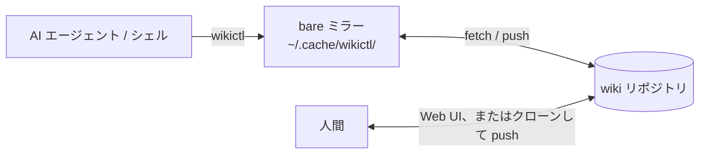

# wikictl

[English](README.md)

wikictl は、Git リポジトリに置いた Markdown の wiki を操作するコマンドラインツールです。AI エージェントと人間が共有する知識ベースを想定しています。エージェントはシェルからページを検索・記録し、人間は同じページを Git ホストの Web UI や、Obsidian などのエディタで開いたクローンで読み書きします。クローンで編集する人は通常どおりコミットして push し、その変更と wikictl の変更はリポジトリ上で合流します。

wikictl はサーバーを起動せず、インデックスも作業ツリーも持ちません。wiki 自体は wikictl に依存しない素の Markdown なので、どのエディタでも扱えます。



## wikictl とクローンの使い分け

wiki は Git リポジトリに置いた素の Markdown なので、`git clone` と標準のコマンドで読み、コミットして push することでも書けます。wikictl が向くのは、作業ツリーを持たないこと自体が目的になる場合です。

- 作業ツリーを手元に置かずに読み書きする。pull するクローンがなく、古くなるツリーもなく、書き込みの前に整合を取るローカルの変更もありません
- 複数のエージェント、あるいは複数のマシンが同じ wiki に同時に書き込む。書き込みは毎回 fetch・コミット・push を行うため、現在のリモートに適用されるか、衝突として拒否されるかのどちらかになり、古い状態のまま読んだ内容が書き込まれることはありません
- リモートを常に正とする。どのコマンドもリモートのミラーを起点に動き、たまたま手元のツリーにある内容を起点にはしません
- 書き込みを 1 コミットにする。`put`・`edit`・`mv`・`rm` は変更を、設定した author による 1 つのコミットとして書き込みます。`mv` は移動したページへのリンクの書き換えも同じコミットに含めます

クローンのほうが速い場合があります。クローンがいったん手元にあれば、標準のコマンドはそれをローカルのファイルシステムから読みますが、wikictl のコマンドは 1 回ごとに別のプロセスとして起動し、リモートを fetch します（`fetch_ttl` で省かれる場合を除く。ミラーの節を参照）。1 台のマシンで完結し、書き込みより読み取りがはるかに多い作業では、クローンは妥当な選択です。

[roamer7038/wikictl-eval](https://github.com/roamer7038/wikictl-eval) は、これをエージェントの課題で計測し、wikictl で読む場合、クローンで読む場合、どちらも使わない場合の品質・費用・時間を報告しています。数値は版によって変わるため、ここには載せず評価側に置いていますが、選ぶ前に知っておく価値のある結論が 2 つあります。文書を読めるかどうかの差は、どう読むかの差よりはるかに大きかったこと。そして、計測したどの条件も、費用と時間でクローンを上回らなかったことです。評価はクローンとの差がどこから来たのかも特定しており、その後 wikictl はその指摘に対応しました。多くのページのフロントマターを 1 回のコマンドでまとめて読むこと（`find --frontmatter`）、履歴（`log` と `cat --at`）、fetch の省略（`fetch_ttl`）、そしてエージェントが最初に読む前提で組み直したヘルプです。これらは試作として計測したもので、現在のコマンドで計測し直してはいません。試作にあったローカルのファイルへの書き出しは、実装していません。

## 前提条件

- Linux または macOS
- `PATH` 上に `git` があること
- 対話なしで wiki リポジトリから fetch し、push できること（credential helper、SSH エージェント、ローカルパスならファイルへのアクセス権）。すべてのコマンドは最初に fetch するため、読み取りだけでもこの条件が必要（`fetch_ttl` で省かれる場合を除く。ミラーの節を参照）
- wiki のブランチへ直接 push できること。プルリクエストを必須にするブランチ保護があると、書き込みはすべて失敗する
- インストールスクリプトを使う場合は `curl` と、`sha256sum` または `shasum`。ソースからビルドする場合は Go 1.26.5 以降

リポジトリは Git ホスト、SSH で接続できるサーバー、ローカルのディレクトリのいずれにも置けます。設定の `repo` はそのまま git に渡されます。

| 置き場所 | `repo` の例 |
|---|---|
| Git ホスト | `git@github.com:you/wiki.git` |
| SSH で接続できるサーバー | `ssh://you@server.example/srv/git/wiki.git` |
| ローカルのディレクトリ | `/home/you/wiki.git` |

`repo` にパスワードやトークンを書かないでください。git は URL をそのままミラーに保存します。HTTPS の URL と git の credential helper、または SSH の URL と SSH エージェントを使ってください。

サーバーやローカルに置く場合は、`git init --bare -b main ~/wiki.git` でリポジトリを作成します。空のリポジトリでは wikictl は `main` に書き込むため、リポジトリの HEAD が `master` など別のブランチを指している場合は、設定の `branch` にそのブランチ名を指定してください。

## インストール

最新リリースを `~/.local/bin` にインストールします。

    curl -fsSL https://raw.githubusercontent.com/roamer7038/wikictl/main/install.sh | sh

スクリプトは OS とアーキテクチャに合うバイナリを選びます。特定のバージョンをインストールするには `WIKICTL_VERSION`（例：`v0.2.0`）を、インストール先を変えるには `WIKICTL_INSTALL_DIR` を設定します。ソースからビルドすることもできます。

    go install github.com/roamer7038/wikictl/cmd/wikictl@latest

Linux と macOS（x86_64、arm64）のバイナリは [Releases ページ](https://github.com/roamer7038/wikictl/releases) にあります。

## クイックスタート

1. 空の wiki リポジトリを作成し、対話なしで `git push` できることを確認します。
2. `~/.config/wikictl/config.yaml` を作成します。

       repo: git@github.com:you/wiki.git
       author:
         name: claude-code@laptop
         email: claude-code@laptop.invalid

3. 設定を確認してから、ページを書き込んで読み出します。空のリポジトリでは、最初の `put` がブランチを作成します。

       wikictl context
       printf -- '---\nsummary: --force-with-lease 付きの push は、リモートの ref が期待する sha のままでなければ拒否される\n---\n# --force-with-lease は何を保証するか\n\n本文。\n' \
         | wikictl put global/git-force-with-lease.md
       wikictl grep lease
       wikictl cat global/git-force-with-lease.md
       wikictl lint

## wiki の構成

wikictl はディレクトリの名前に意味を持たせません。ページはどのディレクトリにも置けます。パスを省略できるコマンド（`grep`、`log`、`links`、`ls`、`find`、`lint`、`tree`）は、パスを省略すると wiki 全体を対象にします。wikictl がカレントディレクトリから対象のディレクトリを選ぶことはありません。

新しく wiki を作る場合の構成の一例は、最上位の各ディレクトリを「その知識がどこで有効か」を表すスコープとし、ページを当てはまる中で最も狭いスコープに置くものです。

| ディレクトリ | 有効な範囲 |
|---|---|
| `global/` | 全員 |
| `personal/` | このユーザーのみ。マシンやプロジェクトは問わない |
| `projects/<name>/` | 特定のプロジェクト |
| `machines/<name>/` | 特定の実行環境 |

この構成では、`personal/` に、エージェントが必要になったときに検索して参照する事実を置きます。すべての会話に適用すべきルールは、`CLAUDE.md` などエージェントに常に読み込まれる指示に書きます。複数人で共有する wiki では全員が同じ `personal/` を読むため、`personal/` は使わないでください。

ページは Markdown ファイルです。最上位にも、いずれかのディレクトリの中にも置けます（パスの要素がドットで始まるものはページとして扱いません）。フロントマターには 1 行の `summary` を書き、他のページとの関係は末尾の `## Links` セクションに書きます。

```markdown
---
summary: このページが答える問いを 1 文で
type: concept
---
# タイトル

本文。他のページへは相対パスでリンクする: [push](git-push.md)。

## Links
- see_also: [push](git-push.md)
- cites: https://example.com/spec | この出典が裏付ける内容
```

- wikictl が解釈するフロントマターのキーは、`summary`（または `description`）、`type`、`tags`、`aliases`、`status: deprecated`（`ls`・`tree` に表示しない）
- ページへのリンクは、`mv` が書き換えられるように `[text](path)` の形式で書く
- 名前には小文字の ASCII 英字、数字、ハイフンを使うことを推奨する

形式の規則の詳細は `wikictl help lint` で確認できます。

## コマンド

| コマンド | 説明 |
|---|---|
| `grep <pattern> [<path>...]` | パターンに一致する行を表示する |
| `cat <path>...` | ファイルを保存されたままの内容で表示する |
| `stat <path>...` | ファイルの sha、最終更新日時、属性を表示する |
| `log [<path>...]` | ファイルを変更したコミットを表示する |
| `links [<path>...]` | ページからのリンクとページへのリンクを一覧表示する |
| `ls [<path>...]` | ディレクトリの中身を一覧表示する |
| `find [<path>...] [<expression>]` | 名前、種類、更新日時、フロントマターでファイルとディレクトリを探す |
| `put <path> < content` | 標準入力の内容でファイルを作成または置換する |
| `edit <path>` | エディタでファイルを編集してコミットする |
| `mv <src>... <dst>` | ファイルやディレクトリを移動・名前変更し、リンクを書き換える |
| `rm <path>...` | ファイルまたはディレクトリを削除する |
| `lint [<path>...]` | wiki の形式に違反するページを報告する |
| `tree [<dir>...]` | ファイルとディレクトリを木構造で表示する |
| `context` | 解決済みの設定を表示する |
| `version` | バージョンを表示する |
| `help [<command>]` | コマンドのヘルプを表示する |

各コマンドのフラグ、挙動、JSON 出力は `wikictl help <command>` で確認できます。`help` 以外のどのコマンドも、`--json` を付けるとプログラムで処理しやすい JSON を出力します。

`grep -l` のように 1 行に 1 つずつ表示されるパスは、`| tr '\n' '\0' | xargs -0 -r wikictl ls -lt` の形で次のコマンドに渡します。引用符や空白を含む名前もそのまま渡り、`-r` は一致が 0 件のときに何も実行しません。`set -o pipefail` を指定すると、`grep` が何も一致しなかったときにパイプライン全体が 1 で終了します。改行を含む名前はこの形では扱えず、制御文字を含む名前も、テキスト出力が `\xNN` にエスケープするため扱えません。正確な名前は `--json` で得られますが、制御文字を含むパスは wikictl が終了コード 4 で拒否します。

`find --frontmatter=KEY,...` は、フロントマターを持つすべてのファイル（ページに限りません）について、キーごとに行番号を付けてフロントマターを返します。多くのページの属性を 1 回のコマンドでまとめて集められます。すべてのキーを返すときは `--frontmatter` とだけ書きます。キーは `=` に続けて書き、`--frontmatter=` のようにキーを空にすると使い方の誤りになります。

既存のページを更新するときは、`stat` が表示する `sha` を `put --base` に渡します。その間にページが変更されていた場合、`put` は終了コード 3 で終了して現在の内容を出力します。wikictl が自動でマージすることはありません。

履歴は `wikictl log [<path>...]` で読みます。1 コミットにつき 1 行で、コミットの sha、author 日時、commit 日時、author、件名を新しいものから順に表示します。既定で 20 件までで、`-n 0` を指定するとすべて表示します。`--since` と `--until` は日付（`YYYY-MM-DD`。UTC の 1 日として解釈します）または RFC 3339 の時刻を取ります。`-S <string>` はその文字列の出現回数が変わったコミットだけに絞り、`--follow`（パスを 1 つだけ取ります）は改名をまたいでファイルを追跡し、各コミット時点のパスを返します。`wikictl cat --at <rev> <path>...` は、`log` が表示したコミット時点のファイルを読みます。

過去の版の `sha` は `--base` には渡せません。古い版に戻すときは、内容を `cat --at` で読み、`put --base` には `stat` が今表示する `sha` を渡します。

## 設定

wikictl は、`--config <path>`、`$WIKICTL_CONFIG`、`$XDG_CONFIG_HOME/wikictl/config.yaml`（`~/.config/wikictl/config.yaml`）のうち最初に当てはまるものを設定ファイルとして読みます。

| キー | 必須 | 意味 |
|---|---|---|
| `repo` | 必須 | wiki リポジトリの URL またはパス。ローカルのパスは設定ファイルのあるディレクトリからの相対パスでもよい。プロファイル側で設定してもよい |
| `branch` | 任意 | 使うブランチ。省略時はミラーに保存したブランチ、なければリモートの HEAD、なければ `main` で、保存したブランチに固定される（`wikictl help context` を参照） |
| `author.name`, `author.email` | 任意 | コミットの author。それぞれ `git config user.name`、`user.email` にフォールバックする |
| `lint.ignore` | 任意 | `lint` の報告と、`put`・`edit`・`mv` の同名の警告から外す規則名。`name_style` と `missing_summary` の 2 つだけ指定できる（`wikictl help lint` を参照） |
| `fetch_ttl` | 任意 | 直前の fetch からこの秒数以内であれば、読み取りの前の fetch を省く。既定の 0 は省かない。`put`・`edit`・`mv`・`rm` には効かず、必ず fetch する（ミラーの節を参照） |
| `profiles` | 任意 | 上記のキーを上書きする名前付きプロファイル |
| `default_profile` | 任意 | 他の規則でプロファイルが決まらないときに使うプロファイル |

未知のキーは、標準エラーに警告を出して無視します。別の版の wikictl に合わせて書いた設定も、そのまま使えます。`1:` のような文字列でないキーは、設定の誤りになります。

プロファイルを使うと、個人用と業務用のように複数の wiki を 1 つの設定ファイルで扱えます。最上位のキーが既定値になり、プロファイルがそれを上書きします。

```yaml
author:
  name: claude-code@laptop
lint:
  ignore: [name_style, missing_summary]
default_profile: personal
profiles:
  personal:
    repo: git@github.com:you/wiki.git
    author:
      email: you@example.invalid
  work:
    repo: git@github.example.com:team/wiki.git
    author:
      email: you@company.example
    lint:
      ignore: []
    match:
      remotes: ["github.example.com/team/*"]
      paths: ["~/work"]
```

プロファイルは、`--profile`、`$WIKICTL_PROFILE`、`match`（`origin` リモートまたはカレントディレクトリ）、`default_profile` の順に最初に当てはまるもので決まります。プロファイル内の `author.name` と `author.email` は個別に上書きされます。プロファイルが `repo` を設定した場合、`branch` は継承されません。`lint` は最上位の値をマージせず置き換えるので、プロファイルで `lint: {}` や `lint: {ignore: []}` と書けば何も無視しない状態にできます。プロファイルで `fetch_ttl: 0` と書けば最上位の `fetch_ttl` を無効に戻せます。省略したプロファイルは最上位の値をそのまま継承します。選択の詳細は `wikictl help context` で確認できます。

## 終了コード

| コード | 意味 |
|---|---|
| 0 | 成功 |
| 1 | エラー（ページが存在しない場合など） |
| 2 | 使い方または設定の誤り。キャッシュディレクトリを作成できないなど、git の失敗でない理由でミラーを準備できない場合と、`cat --at` にミラーが持たないコミットを渡した場合を含む |
| 3 | 衝突（ページが既に存在する、読み取った後にページが変更・削除された、または書き込み中に別の push がブランチを進めた） |
| 4 | ページまたはパスが wiki の形式に違反している。`lint` は指摘が 1 件でもあれば 4 で終了する。ただし存在しないパスがあれば、指摘があっても 1 で終了する |
| 5 | 読み取りまたは書き込みで git コマンドが失敗した |
| 128+N | エディタの実行中にシグナル N を受けて `edit` が終了した（SIGTERM なら 143。`wikictl help edit` を参照） |

`grep` は例外で、一致する行がなければ 1、存在しないパスがあれば 2 で終了します（他のパスの検索は続きます）。

衝突のときは何も書き込まれません。ページを読み直して変更を適用し直すか、理由が `moved` の場合はそのままコマンドをもう一度実行してください。

## ミラー

wikictl は、wiki リポジトリごとの bare ミラーを `$XDG_CACHE_HOME/wikictl/`（`~/.cache/wikictl/`）に、所有者だけが読めるように置きます。パスは `wikictl context` で確認できます。wiki の内容はリモートにあるため、ミラーはいつ削除してもかまいません。次のコマンド実行時に作り直されます。

読み取りは書き込みと同様に、毎回コマンドの前に fetch します。ただし `fetch_ttl`（設定の節を参照）がその秒数以内にすでに fetch 済みだと言えば省き、`--no-fetch` を付ければ `fetch_ttl` に関係なくその 1 回だけ省けます。`fetch_ttl` はシェルのセッションやエージェントの利用など、継続する読み取りのためのものです。`put`・`edit`・`mv`・`rm` には一切効きません。これらは読み取った内容そのものから変更対象を決めるため、古い状態のまま読むと、リモートで追加されたファイルが `rm -r` や `mv` から黙って漏れることがあるからです。ミラー作成直後など、tracking ref がまだ無いときも `fetch_ttl` は効きません。`wikictl context` は `fetch_ttl` と、ミラーに記録された最後の fetch 時刻である `fetched` を表示します。

ミラーであることは、履歴の読み取りにも限界を与えます。`cat --at` が解決するのは、コミットの sha、タグ、そして `origin/main` や `origin/main~1` のような tracking ref です。ミラーが持つ ref はこれらだけなので、`cat --at HEAD` と、`cat --at main` のようなローカルのブランチ名は解決しません。タグは fetch で更新も削除もされないため、リモートで付け替えられたタグは古い値のまま残ります。また、力押しの push で到達不能になったコミットは、ミラーの自動 gc（既定で 2 週間）で消えることがあり、そうなると `log` が表示した sha はもう解決できません。

## 開発

    go test -race ./...
    go vet ./...
    gofmt -l .
    go build -o wikictl ./cmd/wikictl

GitHub Actions は、プルリクエストでこれらを含む検査を実行します（`.github/workflows/` を参照）。ブランチ、プルリクエスト、リリースの運用ルールは [CONTRIBUTING.ja.md](CONTRIBUTING.ja.md) を参照してください。

## ライセンス

[MIT](LICENSE)
