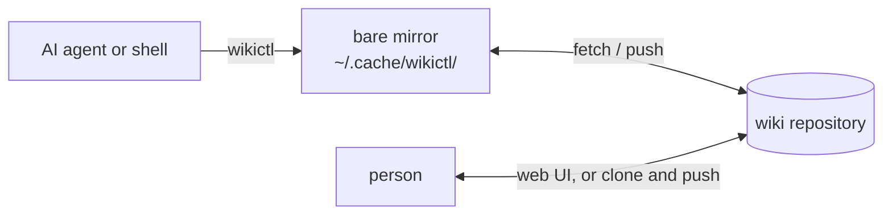

# wikictl

[日本語版](README.ja.md)

wikictl is a command-line tool for a Markdown wiki kept in a Git repository. It is built for a knowledge base shared between AI agents and people: agents search and write pages from the shell, and people read and edit the same pages in a Git host's web UI or in a clone opened with an editor such as Obsidian. People who edit in a clone commit and push as usual; their changes and wikictl's meet in the repository.

wikictl runs no server, keeps no index and uses no working tree. The wiki does not depend on wikictl: it is plain Markdown that any editor can handle.



## Requirements

- Linux or macOS.
- `git` on `PATH`.
- Fetch and push access to the wiki repository without any prompt (a credential helper, an SSH agent or file access for a local path). Every command fetches first, so this applies to reading as well.
- Direct pushes to the wiki branch. Branch protection that requires pull requests blocks every write.
- For the install script: `curl`, and `sha256sum` or `shasum`. For building from source: Go 1.26.5 or later.

The repository can be on a Git host, on a server reachable over SSH or in a local directory; `repo` in the configuration is passed to git as it is:

| Location | Example of `repo` |
|---|---|
| Git host | `git@github.com:you/wiki.git` |
| Server over SSH | `ssh://you@server.example/srv/git/wiki.git` |
| Local directory | `/home/you/wiki.git` |

Do not write a password or token in `repo`: git saves the URL in the mirror as it is. Use an HTTPS URL together with a git credential helper, or an SSH URL with an SSH agent.

On a server or in a local directory, create the repository with `git init --bare -b main ~/wiki.git`. In an empty repository wikictl writes to `main`, so if the repository's HEAD points to another branch, such as `master`, set `branch` in the configuration to that branch.

## Install

Install the latest release into `~/.local/bin`:

    curl -fsSL https://raw.githubusercontent.com/roamer7038/wikictl/main/install.sh | sh

The script picks the binary for your OS and architecture. Set `WIKICTL_VERSION` to install a specific tag, such as `v0.2.0`, and `WIKICTL_INSTALL_DIR` to change the directory. Or build from source:

    go install github.com/roamer7038/wikictl/cmd/wikictl@latest

Binaries for Linux and macOS (x86_64 and arm64) are on the [releases page](https://github.com/roamer7038/wikictl/releases).

## Quick start

1. Create an empty wiki repository and make sure `git push` to it works without prompting.
2. Write `~/.config/wikictl/config.yaml`:

       repo: git@github.com:you/wiki.git
       author:
         name: claude-code@laptop
         email: claude-code@laptop.invalid

3. Check the configuration, then write and read a page. The first `put` creates the branch in the empty repository:

       wikictl context
       printf -- '---\nsummary: A push with --force-with-lease is rejected unless the remote ref still has the expected sha\n---\n# What does --force-with-lease guarantee?\n\nBody.\n' \
         | wikictl put global/git-force-with-lease.md
       wikictl search lease
       wikictl get global/git-force-with-lease.md
       wikictl lint

## Wiki layout

Each top-level directory is a scope that answers "where is this knowledge valid?". Place a page in the narrowest scope that fits:

| Directory | Valid for |
|---|---|
| `global/` | everyone |
| `personal/` | only this user, on every machine and in every project |
| `projects/<name>/` | one project |
| `machines/<name>/` | one execution environment |

`search`, `ls` and `lint` read the whole wiki; wikictl does not choose directories from the current directory.

`personal/` holds facts that an agent looks up when they become relevant; rules for every conversation belong in the agent's standing instructions, such as `CLAUDE.md`. In a wiki shared by several people, everyone reads the same `personal/`, so do not use it there.

A page is a Markdown file inside a directory. Its frontmatter should have a one-line `summary`, and relations to other pages go in a `## Links` section at the end:

```markdown
---
summary: What the page answers, in one sentence
type: concept
---
# Title

Body. Link to other pages with relative paths: [index](index.md).

## Links
- part_of: [index](index.md)
- cites: https://example.com/spec | what this source supports
```

- Frontmatter keys that wikictl interprets: `summary` (or `description`), `type`, `tags`, `aliases` and `status: deprecated`, which hides the page from `search` and `ls`.
- Write links to pages as `[text](path)`, so that `mv` can rewrite them.
- Give each directory an `index.md` whose `summary` states what the directory holds, and link the other pages to it with `- part_of: [index](index.md)`. `wikictl dirs` shows these summaries, and `wikictl get <dir>/index.md` lists the pages as backlinks.
- Names made of lowercase ASCII letters, digits and hyphens are recommended.

`wikictl help lint` describes the format rules in detail.

## Commands

| Command | Purpose |
|---|---|
| `search <word>...` | Find pages containing the given words |
| `get <path>` | Show a page with its sha, links and backlinks |
| `ls` | List pages |
| `put <path> < content` | Create or replace a page from standard input |
| `mv <path> <newpath>` | Move or rename a page or a directory, rewriting links |
| `rm <path>` | Delete a page |
| `lint [<path>...]` | Report pages that violate the wiki format |
| `dirs [<dir>...]` | List the directories of the wiki with their page counts |
| `context` | Show the resolved configuration |
| `help [<command>]` | Show help for a command |
| `version` | Print the version |

`wikictl help <command>` describes the flags, the behavior and the JSON output of each command. Add `--json` to any command except `help` for machine-readable output.

To update an existing page, pass the `sha` printed by `get` to `put --base`. If the page changed in between, `put` exits with code 3 and prints the current content; wikictl never merges.

## Configuration

wikictl reads the configuration from `--config <path>`, else `$WIKICTL_CONFIG`, else `$XDG_CONFIG_HOME/wikictl/config.yaml` (`~/.config/wikictl/config.yaml`).

| Key | Required | Meaning |
|---|---|---|
| `repo` | yes | URL or path of the wiki repository; a local path may be relative to the directory of the configuration file; may be set in a profile instead |
| `branch` | no | Branch to use; defaults to the branch saved in the mirror, else the remote HEAD, else `main`, and the saved branch is kept (see `wikictl help context`) |
| `author.name`, `author.email` | no | Commit author; each falls back to `git config user.name` or `user.email` |
| `profiles` | no | Named profiles that override the keys above |
| `default_profile` | no | Profile to use when no other rule selects one |

An unknown key is a configuration error (exit code 2).

Profiles keep several wikis, such as a personal one and a work one, in one file. The top-level keys are defaults, and a profile overrides them:

```yaml
author:
  name: claude-code@laptop
default_profile: personal
profiles:
  personal:
    repo: git@github.com:you/wiki.git
    author:
      email: you@example.invalid
  work:
    repo: git@github.example.com:team/wiki.git
    author:
      email: you@company.example
    match:
      remotes: ["github.example.com/team/*"]
      paths: ["~/work"]
```

The profile is chosen by `--profile`, else `$WIKICTL_PROFILE`, else `match` (the `origin` remote or the current directory), else `default_profile`. In a profile, `author.name` and `author.email` override separately, and `branch` is not inherited when the profile sets `repo`. `wikictl help context` describes the selection in detail.

## Exit codes

| Code | Meaning |
|---|---|
| 0 | success |
| 1 | error, for example a missing page |
| 2 | usage or configuration error |
| 3 | conflict: the page already exists, or changed or was deleted since it was read |
| 4 | the page or path violates the wiki format; `lint` exits with 4 on any finding |
| 5 | a git command failed, while reading or writing |

## Mirror

wikictl keeps a bare mirror of each wiki repository under `$XDG_CACHE_HOME/wikictl/` (`~/.cache/wikictl/`), readable only by the user. `wikictl context` shows its path. The wiki content is on the remote, so a mirror can be deleted at any time; the next command creates it again.

## Development

    go test -race ./...
    go vet ./...
    gofmt -l .
    go build -o wikictl ./cmd/wikictl

GitHub Actions runs these checks and more on pull requests (see `.github/workflows/`). See [CONTRIBUTING.md](CONTRIBUTING.md) for the branch, pull request and release rules.

## License

[MIT](LICENSE)
