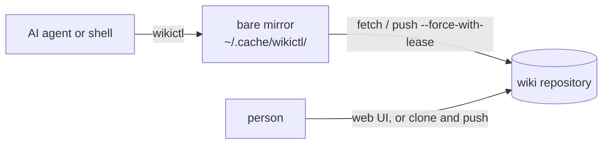

# wikictl

[日本語版](README.ja.md)

wikictl is a command-line tool for a Markdown wiki kept in a Git repository. It is built for a knowledge base shared between AI agents and people: agents search and write pages from the shell, and people read and edit the same pages in a Git host's web UI or in a clone opened with an editor such as Obsidian.

The repository can be on a Git host (GitHub, GitLab, Gitea, ...), on a server reachable over SSH, or in a local directory; no hosting service is required.

wikictl runs no server, keeps no index and uses no working tree. It fetches into a bare mirror and reads with `git grep`, `git cat-file` and `git log`; it writes by building a commit with git plumbing and pushing it with `--force-with-lease`. The wiki does not depend on wikictl: it is plain Markdown that any editor can handle.



## Requirements

- Linux or macOS.
- `git` on `PATH`.
- A wiki repository that you can fetch from and push to without any prompt (a credential helper, an SSH agent, or file access for a local path). wikictl runs git with prompts disabled, so a command that needs a password fails instead of waiting. Every command fetches first, so this applies to reading as well.
- Direct pushes to the wiki branch. Branch protection that requires pull requests blocks every write.
- For the install script: `curl`, and `sha256sum` or `shasum`. For building from source: Go 1.26.5 or later.

### Where the wiki repository can live

`repo` in the configuration is passed to git as it is, so any URL or path that git can push to works:

| Location | Example of `repo` |
|---|---|
| Git host | `git@github.com:you/wiki.git` |
| Server over SSH | `ssh://you@server.example/srv/git/wiki.git` |
| Local directory | `/home/you/wiki.git` |

On a server or in a local directory, create an empty bare repository with the branch name given:

    git init --bare -b main ~/wiki.git

In an empty repository wikictl cannot read the branch from the remote HEAD and writes to `main`. If the repository was created without `-b main` and its HEAD points to `master`, `git clone` then warns that the remote HEAD refers to a nonexistent ref and checks out nothing. Either create it with `-b main` or set `branch` in the configuration to the branch the HEAD points to.

People who do not use a Git host's web UI clone the repository, edit, commit and push as usual. wikictl never uses those clones; its changes and theirs meet in the repository.

## Install

Install the latest release into `~/.local/bin`:

    curl -fsSL https://raw.githubusercontent.com/roamer7038/wikictl/main/install.sh | sh

The script picks the binary for your OS and architecture, verifies its checksum and warns if `~/.local/bin` is not on your `PATH`. Set `WIKICTL_VERSION` to install a specific tag, such as `v0.2.0`, and `WIKICTL_INSTALL_DIR` to change the directory.

Or build from source with Go:

    go install github.com/roamer7038/wikictl/cmd/wikictl@latest

Binaries for Linux and macOS (x86_64 and arm64) and their checksums are on the [releases page](https://github.com/roamer7038/wikictl/releases).

## Quick start

1. Create an empty repository, on your Git host or with `git init --bare -b main` (see [Where the wiki repository can live](#where-the-wiki-repository-can-live)), and make sure `git push` to it works without prompting.
2. Write `~/.config/wikictl/config.yaml`:

       repo: git@github.com:you/wiki.git
       author:
         name: claude-code@laptop
         email: claude-code@laptop.invalid

3. Check the configuration, create the initial pages, then write and read a page:

       wikictl context
       wikictl init
       printf -- '---\nsummary: A push with --force-with-lease is rejected unless the remote ref still has the expected sha\n---\n# What does --force-with-lease guarantee?\n\nBody.\n\n## Links\n- part_of: [index](index.md)\n' \
         | wikictl put global/git-force-with-lease.md
       wikictl search lease
       wikictl get global/git-force-with-lease.md
       wikictl lint

Add `--json` to any command for machine-readable output.

## Wiki layout

### Scopes

Each top-level directory is a scope that answers "where is this knowledge valid?":

| Directory | Valid for |
|---|---|
| `global/` | everyone |
| `personal/` | only this user, on every machine and in every project (commit conventions, which account to use for what, tool choices) |
| `projects/<name>/` | one project |
| `machines/<name>/` | one execution environment |

Place a page in the narrowest scope that fits: only this project → `projects/<name>/`; only this execution environment → `machines/<name>/`; only this user → `personal/`; otherwise → `global/`.

`personal/` holds facts an agent looks up when they become relevant. Rules that must apply to every conversation belong in the agent's standing instructions (for Claude Code, `CLAUDE.md`), not in the wiki.

`personal/` assumes one person uses the wiki. Everyone who shares a wiki searches the same `personal/`, so in a wiki shared by several people either do not use `personal/`, or set `dirs` in the configuration to choose the search directories.

`init` creates only `global/`. The other directories appear with the first `put` into them.

### Search directories

By default, `search`, `ls` and `lint` look at up to four directories:

- `global/`
- `personal/`
- `projects/<name>/`, where `<name>` is the repository name in the URL of the `origin` remote of the current directory: its last path element, without `.git`, in lowercase. The `projects` key of the configuration maps this name to another directory name. The directory is skipped when the current directory is not in a git repository or has no `origin` remote.
- `machines/<name>/`, where `<name>` is the `machine` key of the configuration, or else the hostname up to the first `.`, in lowercase.

`--dirs a,b` on the command line, or `dirs` in the configuration, replaces the list. `--dirs .` covers the whole wiki. Directories that do not exist are ignored. `wikictl context` shows the list with the number of pages at any depth under each directory.

### Page format

A page is a Markdown file in a subdirectory (never at the root). Its frontmatter should have a one-line `summary`:

```markdown
---
summary: What the page answers, in one sentence
type: concept
---
# Title

Body. Link to other pages with relative paths: [index](index.md).

## Links
- part_of: [index](index.md)
- cites: https://example.com/spec | what this source supports
```

Frontmatter:

- `summary` is recommended, not required. Without it, `put` still writes the page with a `missing_summary` warning, `lint` reports `missing_summary`, and `search` and `ls` show the title (the first heading, else the file name) instead. A page without frontmatter is treated the same way.
- `description` is read as a synonym of `summary`; `summary` wins when both are present.
- Optional keys: `type`, `status`, `tags`, `aliases`, `review_after`. A line `status: deprecated` hides the page from `search` and `ls` unless `--all` is given.

Links:

- A link to a page is a relative path ending in `.md`, optionally with a `#fragment`. Absolute paths and paths that leave the wiki are not page links.
- The `## Links` section, when present, is the last heading. Each line is `- <type>: <target> | <note>`, where `<target>` is a relative path or a URL and `| <note>` is optional.
- A line with only a target, `- <target>`, is a `see_also` relation; an untyped URL target must be of the form `<scheme>://...`.
- The bullet may be `-`, `*` or `+` and may be indented.
- Links in the body, of the form `[text](path)`, are also read: `get` lists them in the target's backlinks as `mentions`, and `lint` reports them when their target is missing.
- Write page targets as `[text](path)`. `mv` rewrites only links of that form; a bare path such as `- part_of: index.md` or `- index.md` is left unchanged and becomes a broken link when its target moves.
- Code fences are never interpreted: a `## Links` heading inside a fence does not start the section. Links inside fences, and inside code spans in the body, are not read as body links.

File and directory names:

- A name must not be empty, start with `.` or `<`, or contain whitespace, control characters or any of ``" \ # ? : ( ) ` ``, and a page ends in `.md`. `put` and `mv` reject other paths (`bad_path`, exit code 4).
- Lowercase ASCII letters, digits and hyphens are recommended. `lint` reports other names as `name_style`, and names in one directory that differ only by case (which collide on case-insensitive file systems) as `case_collision`.

Give each directory an `index.md` whose `summary` states what the directory holds, and link the other pages in it to the index with `- part_of: [index](index.md)`. `wikictl get <dir>/index.md` then lists those pages as `backlinks`, and `wikictl dirs` shows the summary next to the directory, so the structure of the wiki describes itself without any generated content.

## Commands

| Command | Purpose |
|---|---|
| `init` | Create `README.md` and `global/index.md` in an empty repository |
| `search <word>...` | Find pages containing all of the words |
| `get <path>` | Show one page with its sha, frontmatter, body, links and backlinks |
| `ls` | List the pages under the search directories |
| `put <path> < content` | Create or replace a page from standard input |
| `mv <path> <newpath>` | Move or rename a page and rewrite links to it |
| `mv <dir>/ <newdir>/` | Move every page under a directory |
| `rm <path>` | Delete a page |
| `lint [<path>...]` | Report format violations |
| `dirs [<dir>...]` | List the directories of the whole wiki with their page counts and `index.md` summaries |
| `context` | Show the resolved configuration and search directories with their page counts |
| `help [<command>]` | Show the list of commands, or the details and flags of one command |
| `version` | Print the version |

Command flags:

| Flag | Commands | Meaning |
|---|---|---|
| `--any` | `search` | Find pages containing any of the words instead of all of them |
| `-n <N>` | `search` | Show at most N results (default 20) |
| `--all` | `search`, `ls` | Include pages with `status: deprecated` |
| `--type <type>` | `ls` | Only pages with this `type` |
| `--tag <tag>` | `ls` | Only pages with this tag |
| `--base <sha>` | `put` | Blob sha of the existing page, as printed by `get` |
| `-m <message>` | `put`, `mv`, `rm` | Commit message (default: `wikictl: <command> <arguments>`) |

Global flags, accepted before or after the command:

| Flag | Meaning |
|---|---|
| `--json` | Print JSON |
| `--dirs a,b` | Search only these directories; `.` is the whole wiki |
| `--config <path>` | Read the configuration from this file |
| `--profile <name>` | Use this profile |
| `--no-fetch` | Skip the fetch that normally precedes every command |
| `--version` | Print the version |

Details of each command:

- `init` writes both files in one commit. It fails with exit code 1 if the branch already exists.
- `search` matches the words as fixed strings, ignoring case, anywhere in the file, frontmatter included. Results are ordered by last update, newest first; with `--any`, pages matching more words come first.
- `get` prints the page parsed: the body without the frontmatter and the Links section, the links, and the backlinks from other pages. The frontmatter is included only with `--json`. It does not print the file as stored.
- `put` reads the whole page, frontmatter included. An invalid frontmatter or a bad path is rejected with exit code 4; other problems (`missing_summary`, `broken_link`, `links_syntax`, `name_style`) are printed as warnings and the page is written.
- `mv` rewrites the links inside the moved page and the links to it from other pages in the same commit, and adds the old file name (without `.md`) to `aliases` when the file name changes. It fails with exit code 1 if the destination exists. The directory form fails if any page exists under `<newdir>/`.
- `rm` leaves the pages that link to the deleted page unchanged; `lint` reports those links as `broken_link`.
- `lint` checks the given pages, or every page under the search directories. `case_collision` is checked against the whole wiki.
- `dirs` lists every directory that directly contains a page, with the number of pages directly in it (deprecated pages included) and the `summary` of its `index.md`, or `(no index)`. It ignores the search directories; `wikictl dirs projects` restricts the list to the directories under `projects/`.
- `context` shows the configuration file, the selected profile and how it was selected, the repository, the mirror, the branch, the author, the machine and project names, the `origin` remote of the current directory, and the search directories with their page counts.

`wikictl help <command>` describes each command, its flags and the fields of its JSON output.

## Usage

### Updating a page without overwriting someone else's change

1. `wikictl get <path>` prints the blob `sha` of the page.
2. Write the new content and pass the sha back: `wikictl put --base <sha> <path> < page.md`.
3. If the page changed in between, `put` exits with code 3 and prints the current content and `sha` (see [Output](#output)). Re-read, reapply your change and `put` again.

Writing to an existing page without `--base` is also a conflict (exit code 3). No merge state is ever created.

`get` does not print the page as stored: the frontmatter and the Links section appear only as parsed fields in `--json`. The stored content is printed when `put` reports a conflict.

wikictl processes on one machine take a lock on the mirror and write one at a time. When another push reaches the repository first, wikictl fetches, checks `--base` again and retries, up to three attempts. `mv` and `rm` take no `--base`: `mv` writes the pages it rewrites as they were when it read them, so a change pushed to one of those pages in the meantime is overwritten.

### Moving and deleting pages

`wikictl mv global/old.md global/new.md` moves a page and rewrites every `[text](path)` link to it. `wikictl mv projects/app/ projects/app-v2/` moves a whole directory. Links written as bare paths are not rewritten; run `wikictl lint` afterwards to find them.

`wikictl rm <path>` deletes a page without touching the pages that link to it; `wikictl lint` lists the links that are now broken.

### Seeing the structure of the wiki

Before deciding where a page goes, `wikictl dirs` shows every directory of the wiki with its page count and the summary of its `index.md`. `wikictl context` shows which directories `search`, `ls` and `lint` look at from the current directory.

## Configuration

wikictl reads the file given by `--config <path>`; otherwise the file named by `$WIKICTL_CONFIG`; otherwise `$XDG_CONFIG_HOME/wikictl/config.yaml` (`~/.config/wikictl/config.yaml` when `$XDG_CONFIG_HOME` is not set).

| Key | Required | Meaning |
|---|---|---|
| `repo` | yes | URL or path of the wiki repository; may be set in a profile instead |
| `branch` | no | Branch to use; when omitted, taken from the remote HEAD, or `main` when that cannot be determined (see [Mirror](#mirror)) |
| `author.name`, `author.email` | no | Commit author and committer; falls back to `git config user.name` and `user.email`. A write fails with exit code 2 when neither is set |
| `machine` | no | Name for `machines/<name>/`; defaults to the hostname up to the first `.` |
| `dirs` | no | Fixed list of search directories instead of the default four |
| `projects` | no | Map from the repository name of the `origin` remote to the directory name under `projects/` |
| `profiles` | no | Named profiles that override the keys above; see below |
| `default_profile` | no | Profile to use when no other rule selects one |

An unknown key, such as a misspelt `default_profle` or `match.remote`, is a configuration error (exit code 2) that names the key, so a typo never silently selects another wiki.

### Profiles

Profiles keep several wikis, such as a personal one and a work one, in one file. The top-level keys are defaults; a profile overrides them:

```yaml
author:
  name: claude-code@laptop
default_profile: personal
profiles:
  personal:
    repo: git@github.com:you/wiki.git
    author:
      email: you@example.invalid
  work:
    repo: git@github.example.com:team/wiki.git
    author:
      email: you@company.example
    match:
      remotes: ["github.example.com/team/*"]
      paths: ["~/work"]
```

The profile is chosen by the first of these that applies:

1. `--profile <name>`
2. `$WIKICTL_PROFILE`
3. `match`: a profile matches when any of its `remotes` or `paths` matches.
   - `remotes` are globs over the `origin` remote of the current directory, written as `host/path` in lowercase without scheme, user, port and `.git`, so the SSH and HTTPS URLs of the same repository match the same pattern.
   - A `*` in the middle matches one path element; a trailing `/*` matches every path below it. For example, `gitlab.example.com/team/*` matches `team/app` and the subgroup repository `team/sub/app`, but not `team` itself, while `gitlab.example.com/*/app` matches `team/app` but not `team/sub/app`.
   - `paths` are directories given as absolute paths or paths starting with `~`; the current directory matches when it is one of them or below one.
   - If more than one profile matches, the command fails with exit code 2.
4. `default_profile`
5. No profile: only the top-level keys are used.

An unknown profile name is an error (exit code 2). In a profile, `author.name` and `author.email` override separately, `dirs` and `projects` replace the top-level values (a profile's `dirs` also replaces the default four directories), and `branch` is not inherited when the profile sets `repo`. `wikictl context` shows the selected profile, how it was selected and the repository.

## Output

Without `--json`, commands print text on standard output. With `--json`, they print one JSON object; `wikictl help <command>` lists its fields.

Warnings go to standard error in both modes, one per line:

    wikictl: warning: <path>:<line>: <code>: <message>

Errors go to standard error as `wikictl: <message>`. With `--json`, they are printed on standard output as `{"error": "<kind>", "message": "..."}`, where `<kind>` is `error`, `usage`, `conflict`, `invalid` or `git`.

A conflict from `put` carries the current page. As text, one line goes to standard error and the current content to standard output:

    wikictl: conflict (<reason>): <path> sha=<sha>

With `--json`:

    {"error": "conflict", "reason": "<reason>", "path": "...", "sha": "...", "content": "...", "message": "..."}

`<reason>` is `exists` when a page written without `--base` already exists, or `changed` when the page no longer has the sha given with `--base`. `sha` and `content` are empty when the page has been deleted.

### Exit codes

| Code | Meaning |
|---|---|
| 0 | success |
| 1 | error, for example a missing page |
| 2 | usage or configuration error |
| 3 | conflict: the page changed since it was read |
| 4 | the page violates the wiki format: `put` and `mv` reject invalid frontmatter or a bad path; `lint` exits with 4 on any finding |
| 5 | a git command failed |

### Lint codes

`lint` prints one finding per line as `<path>:<line>: <code>: <message>`; line 0 means the whole file.

| Code | Finding | On `put` |
|---|---|---|
| `bad_path` | The path breaks the file name rules | rejected |
| `frontmatter_invalid` | The frontmatter is not valid YAML | rejected |
| `missing_summary` | No `summary` or `description`, or no frontmatter | warning |
| `links_syntax` | A line in the Links section is not a valid link line | warning |
| `broken_link` | A link points to a page that does not exist | warning |
| `name_style` | A name is not lowercase ASCII letters, digits and hyphens | warning |
| `case_collision` | Names in one directory differ only by case | not checked |

## Mirror

wikictl keeps one bare mirror per repository under `$XDG_CACHE_HOME/wikictl/` (`~/.cache/wikictl/` when `$XDG_CACHE_HOME` is not set). `wikictl context` shows its path.

- When `branch` is not configured, the branch is taken from the remote HEAD the first time and saved in the mirror. A later change of the remote's default branch is not followed; set `branch`, or delete the mirror.
- If the mirror ever breaks, delete it; the next command recreates it.

## Development

    go test ./...
    go build -o wikictl ./cmd/wikictl

GitHub Actions runs `gofmt -l`, `go vet` and `go test` on pushes to `main` and on pull requests. Pushing a tag that starts with `v` builds the binaries and `checksums.txt` with GoReleaser and publishes them as a release.

## License

[MIT](LICENSE)
